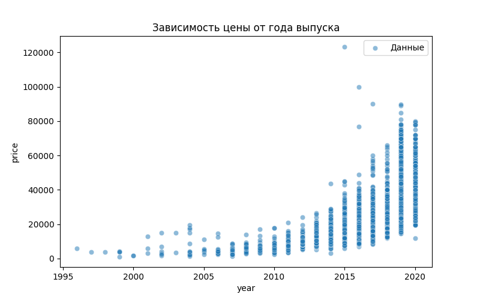
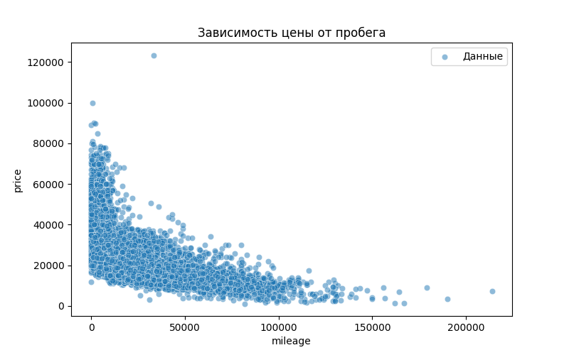
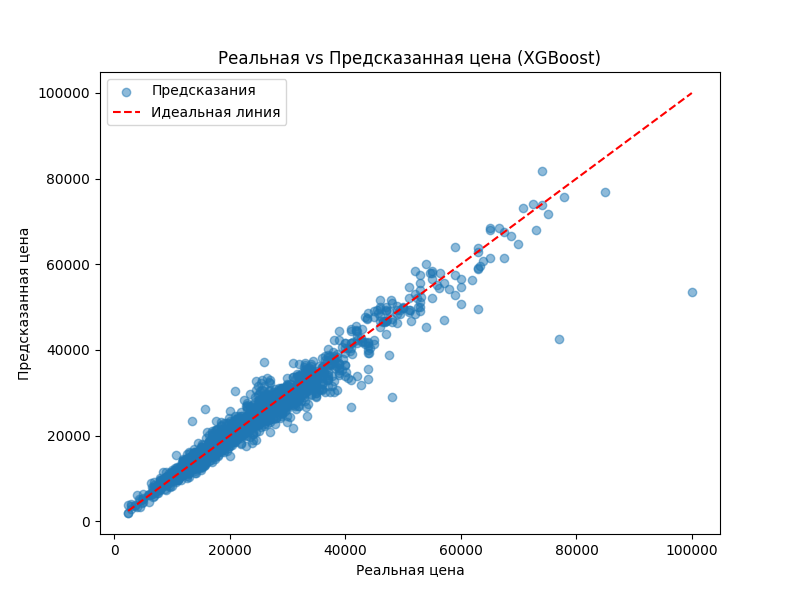
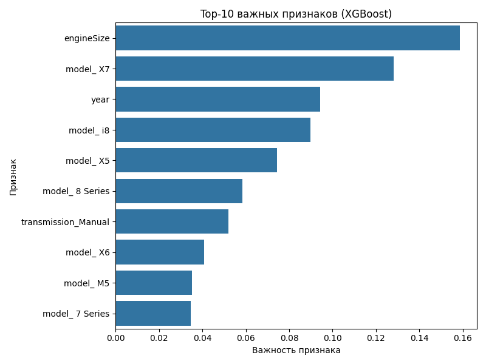

# 🚗 Прогноз цен BMW — Модель машинного обучения для оценки стоимости автомобиля


> Полноценный ML-проект по предсказанию стоимости автомобилей BMW: обработка данных, обучение моделей, визуализации и автоматическая генерация отчётов.

---

## 🧠 Обзор проекта

Скрипт предсказывает рыночную стоимость BMW на основе:

- года выпуска  
- пробега  
- объёма двигателя  
- расхода топлива  
- коробки передач  
- модели автомобиля  

ML-пайплайн полностью автоматизирован:

- предобработка  
- расчёт мультиколлинеарности (VIF)  
- обучение 3 моделей  
- сравнение качества  
- построение графиков  
- сохранение отчётов  

---

## 🏆 Основные результаты

Проект автоматически формирует следующие файлы:

- **model_metrics.csv**  
- **vif_report.csv**  
- **processed_data.csv**  
- 5 PNG-графиков  
- вывод важности признаков  

---

## 📊 Датасет

Источник: **bmw.csv**

### Пример структуры:

| model | year | price | transmission | mileage | fuelType | engineSize |
|------|------|-------|--------------|---------|----------|------------|
| 1 Series | 2017 | 15000 | Manual | 42000 | Diesel | 1.5 |

---

## 🔬 Рабочий процесс

1. Загрузка данных  
2. Удаление дублей  
3. Заполнение пропусков  
4. One-Hot Encoding  
5. Расчёт VIF  
6. Split Train/Test  
7. Обучение моделей  
8. Построение графиков  
9. Сохранение отчётов  

---

## 📈 Эффективность моделей

| Модель                | MAE ↓ | RMSE ↓ | R² ↑ |
|----------------------|-------|--------|------|
| Линейная регрессия   | 2778  | 4235   | 0.85 |
| Random Forest        | 1544  | 2662   | 0.94 |
| XGBoost              | 1460  | 2452   | 0.95 |

---

## 🧩 Важность признаков

### 🎯 Вклад ключевых признаков (XGBoost):

- **year** — ~45%  
- **engineSize** — ~30%  
- **mileage** — ~8%  
- Остальные — менее 5%  

---

## 📊 Визуализации

### Цена vs год выпуска


---

### Цена vs пробег


---

### Реальная vs предсказанная цена (XGBoost)


---

### Важность признаков — Random Forest


---

### Важность признаков — XGBoost


---

## 📁 Структура проекта

```text
project/
│
├── bmw.csv
├── main.py
│
└── outputs/
    ├── model_metrics.csv
    ├── processed_data.csv
    ├── vif_report.csv
    ├── real_vs_pred.png
    ├── price_vs_year.png
    ├── price_vs_mileage.png
    ├── rf_feature_importance_top10.png
    └── xgb_feature_importance_top10.png

```

---

## 🛠 Технологии

Python 3.10+

Pandas

NumPy

Scikit-learn

XGBoost

Statsmodels

Matplotlib / Seaborn

---

## 💡 Выводы

XGBoost — лучшая модель

Год выпуска и пробег — ключевые признаки

Пайплайн полностью автоматизирован

Проект универсален и расширяем

---

## Контакты

github - PixeledFankon

emails - tamer.zwer@mail.ru / adilet.gilmanov@mail.ru

---
